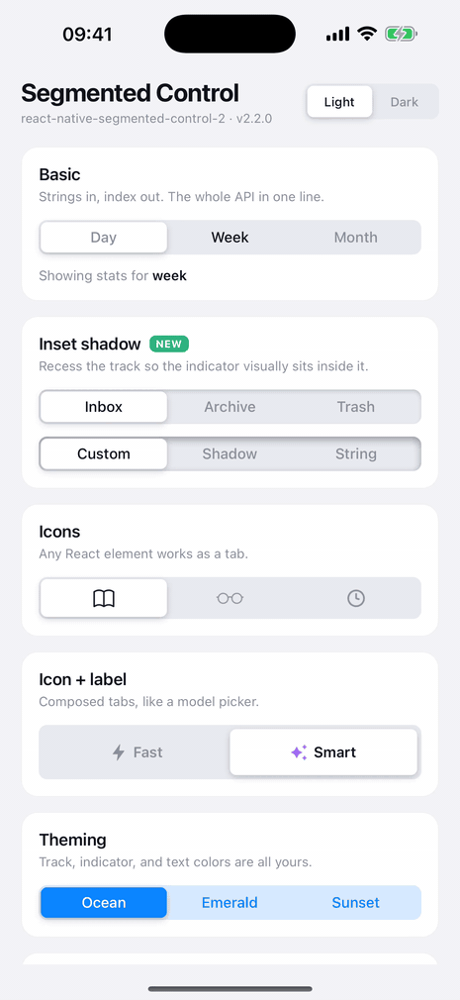

[](https://github.com/kuraydev/react-native-segmented-control-2)

[](https://www.npmjs.com/package/react-native-segmented-control-2)
[](https://www.npmjs.com/package/react-native-segmented-control-2)

[](https://opensource.org/licenses/MIT)
[](https://github.com/prettier/prettier)

<p align="center">
  
</p>

An iOS-style segmented control for React Native — pure JavaScript, one component, zero native code.

## Highlights

- 🪶 **Zero dependencies** — plain React Native, works everywhere RN works
- 🎬 **Springy sliding indicator** — animated with the native driver
- 🎛 **Controlled or uncontrolled** — pass `value` to own the state, or let it manage itself
- 🧩 **Any element as a tab** — strings, icons, or fully composed views
- 🎨 **Fully themeable** — track, indicator, text, per-tab styles
- 🕳 **Inset shadow** — recess the track with an inner shadow _(new in 2.2)_
- 🌍 **RTL support** — indicator direction follows `I18nManager`
- ♿️ **Accessible** — tabs expose `button` role with `selected` / `disabled` states
- 🏗 **New Architecture ready** — even tab distribution and correct indicator offsets under Fabric
- 🟦 **TypeScript** — written in TS, types shipped in the box

## Installation

```bash
npm install react-native-segmented-control-2
# or
yarn add react-native-segmented-control-2
```

## Quick start

```tsx
import SegmentedControl from "react-native-segmented-control-2";

<SegmentedControl
  tabs={["Day", "Week", "Month"]}
  onChange={(index) => console.log(index)}
/>;
```

That's the whole API: an array of tabs in, the pressed index out.

## Usage

### Controlled

Pass `value` to drive the selection from your own state — useful when other
UI (buttons, gestures, remote state) can change the selection too.

```tsx
const [index, setIndex] = useState(0);

<SegmentedControl
  tabs={["One", "Two", "Three"]}
  value={index}
  onChange={setIndex}
/>;
```

Without `value`, the component manages its own state; use `initialIndex` to
pick the starting tab.

### Theming

Track, indicator, and text colors are all styleable:

```tsx
<SegmentedControl
  tabs={["Income", "Expenses", "Exchange"]}
  style={{ backgroundColor: "#D6E9FF" }}
  activeTabColor="#0A84FF"
  activeTextColor="#FFFFFF"
  textStyle={{ color: "#0A84FF" }}
  onChange={(index) => console.log(index)}
/>
```

### Inset shadow — _new in 2.2_ 🕳

Recess the track with an inner shadow so the raised indicator visually sits
inside it. Pass `true` for a sensible default, or a CSS-like `boxShadow`
string for full control:

```tsx
<SegmentedControl
  tabs={["Inbox", "Archive", "Trash"]}
  insetShadow
  onChange={(index) => console.log(index)}
/>

<SegmentedControl
  tabs={["Inbox", "Archive", "Trash"]}
  insetShadow="inset 0 3px 8px rgba(0, 0, 0, 0.35)"
  onChange={(index) => console.log(index)}
/>
```

> Uses React Native's `boxShadow` style, available on RN 0.76+. On older
> versions the prop is ignored and the track stays flat.

### Any element as a tab

Tabs don't have to be strings — pass any React element:

```tsx
<SegmentedControl
  tabs={[
    <Icon name="book" />,
    <Icon name="glasses" />,
    <Icon name="history" />,
  ]}
  onChange={(index) => console.log(index)}
/>
```

Compose freely — icon + label rows, badges, whatever you need. See the
[example app](example/App.tsx) for an icon-and-label "model picker" tab.

### Per-tab styles

`tabStyle` accepts a plain style or a function of the tab index:

```tsx
<SegmentedControl
  tabs={["S", "M", "L", "XL"]}
  tabStyle={(index) => ({ opacity: index === 3 ? 0.5 : 1 })}
  onChange={(index) => console.log(index)}
/>
```

### Disabled & testing

```tsx
<SegmentedControl
  tabs={["Draft", "Published"]}
  disabled={isLocked}
  testID="status-switch" // tabs get "status-switch-tab-0", "-tab-1", …
  onChange={setStatus}
/>
```

## Props

### Fundamentals

| Property   |             Type             |  Default  | Description                                         |
| ---------- | :--------------------------: | :-------: | --------------------------------------------------- |
| `tabs`     | `(string \| ReactElement)[]` | required  | the tabs to render                                  |
| `onChange` |  `(index: number) => void`   | required  | called with the index of the pressed tab            |
| `value`    |           `number`           | undefined | selected index, when used as a controlled component |

### Customization

| Property           |                    Type                     |  Default  | Description                                                                                                          |
| ------------------ | :-----------------------------------------: | :-------: | -------------------------------------------------------------------------------------------------------------------- |
| `initialIndex`     |                  `number`                   |    `0`    | starting tab for uncontrolled usage                                                                                  |
| `style`            |                 `ViewStyle`                 |  default  | style of the outer track container                                                                                   |
| `activeTabColor`   |                  `string`                   |  `#FFF`   | color of the sliding indicator                                                                                       |
| `activeTextColor`  |                  `string`                   |  `#000`   | text color of the active tab                                                                                         |
| `textStyle`        |                 `TextStyle`                 |  default  | style of every tab's text                                                                                            |
| `activeTextStyle`  |                 `TextStyle`                 |  default  | extra text style applied only to the active tab                                                                      |
| `tabStyle`         | `ViewStyle \| (index: number) => ViewStyle` |  default  | style of each tab; pass a function for per-tab styles                                                                |
| `selectedTabStyle` |                 `ViewStyle`                 |  default  | extra style for the sliding indicator                                                                                |
| `gap`              |                  `number`                   |    `2`    | inset between the indicator and the track edges                                                                      |
| `insetShadow`      |             `boolean \| string`             |  `false`  | recess the track with an inner shadow; `true` uses a default, or pass a `boxShadow` string to customize _(RN 0.76+)_ |
| `disabled`         |                  `boolean`                  |  `false`  | stop the tabs from responding to presses                                                                             |
| `testID`           |                  `string`                   | undefined | set on the container; each tab also gets `` `${testID}-tab-${index}` ``                                              |

## TypeScript

Props and tab types are exported:

```tsx
import SegmentedControl, {
  SegmentedControlProps,
  TabItem,
} from "react-native-segmented-control-2";
```

## Example app

The [`example/`](example) folder is an Expo app showcasing every feature —
it's the app in the demo above, including an in-app light/dark theme switch.

```bash
cd example
npm install
npx expo start --ios   # or --android
```

## Credits

Originally inspired by
[react-native-segmented-control/segmented-control](https://github.com/react-native-segmented-control/segmented-control)
and
[Karthik-B-06/react-native-segmented-control](https://github.com/Karthik-B-06/react-native-segmented-control) —
built as an actively maintained, pure-JavaScript alternative with more
customization.

Thanks to @madox2 for controlled-component support and @philo23 for removing
the screen-width dependency.

## Author

FreakyCoder, kurayogun@gmail.com

## License

React Native Segmented Control 2 is available under the MIT license. See the
LICENSE file for more info.
